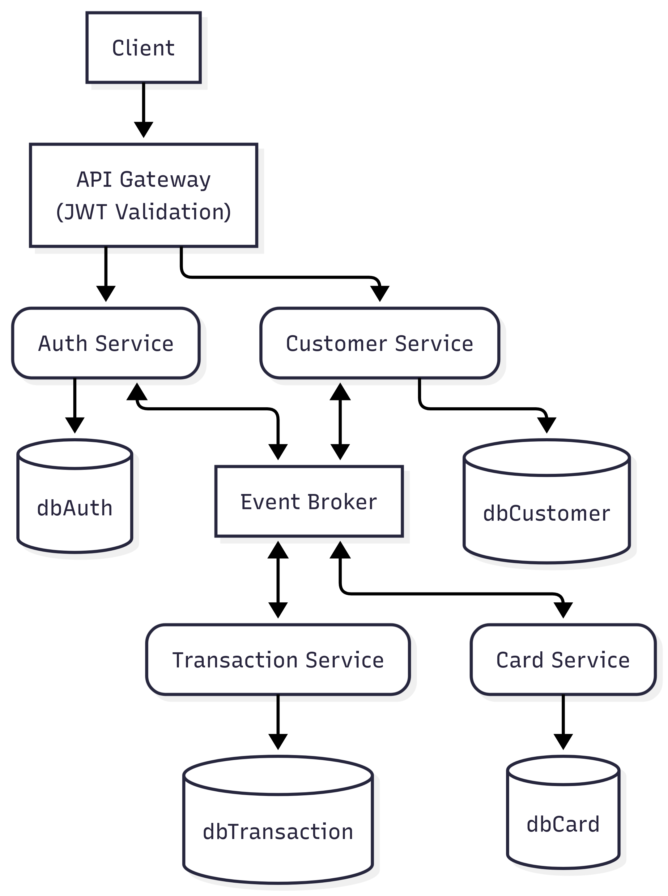

<div align="center">
    <h1 style="font-weight: bold;">Brabank</h1>
</div>

<div align="center">
    <a href="#about">Sobre</a> • 
    <a href="#tech">Tecnologias</a> • 
    <a href="#tech-details">Detalhes Técnicos</a> • 
    <a href="#usage">Instruções de Uso</a> • 
    <a href="#install">Instalação</a> •
    <a href="#colab">Colaboradores</a> •
    <a href="#contribute">Contribua</a>
</div>

<div align="center">
    <b>Perfeito para pagamentos, transações, empréstimo e mais!</b>
</div>


<h2 id="about">Sobre</h2>
O Brabank é uma fintech motivada a facilitar a vida financeira das pessoas.
Através da simplificação e facilitação de:

- PIX e outras transações
- Transações e saques com cartões de crédito e débito
- Empréstimos
- Investimentos
- Financiamento
- E muito mais!


<div style="background-color: #6b6868; padding: 5px 20px 20px; color: white;">
    <p style="font-size: 20px; font-weight: bold; color: white;">IMPORTANTE!</p>
    Destaca-se que este é um projeto pensado para produção, porém puramente acadêmico.
</div>

<h2 id="tech">Tecnologias</h2>

- Java 17
- Maven
- PostgreSQL 15
- Flyway
- Docker/Docker Compose
- Maven
- Hibernate
- JPA

<h2 id="tech-details">Detalhes Técnicos</h2>

<h3> Arquitetura </h3>

Dada a proposta de ser uma fintech, o projeto traz consigo
a arquitetura de microsserviços com comunicação assíncrona
baseada em eventos.

Além disso, cada microsserviço implementa a arquitetura hexagonal,
evitando assim forte acoplamento a serviços e tecnologias específicas.
Veja o diagrama abaixo:



<h3>Estrutura de Microsserviços</h3>
O Brabank é dividido em 4 microsserviços:

- <h4>Auth Service</h4>
Responsável por gerenciar a identidade dos usuários, gerar tokens de autenticação e produção de eventos relacionados à autenticação e identidade dos usuários.

- <h4>Transaction Service</h4>
Responsável por validar, gerenciar, realizar e reportar transações como PIX, TED e DOC.

- <h4>Card Service</h4>
Responsável por gerar, atualizar, excluir e gerenciar o uso dos cartões dos usuários.

- <h4>Customer Service</h4>
Responsável por cadastrar clientes, atualização e consulta de dados, situação da conta, contato com outros microsserviços e suporte. 


<h3>Gateway</h3>

O projeto terá um Gateway implementado para seus microsserviços, entretanto, acreditamos que ainda não é o momento.
A implementação do Gateway está planejada para ser realizada assim que o primeiro microsserviço for finalizado (Auth Service).

<h2 id="usage">Instruções de Uso</h2>

Recomendamos o uso por meio de um API Client como APIDog, Insomnia ou Postman.
Verifique a documentação para ver a lista de endpoints e seus detalhes.

<h2 id="install">Instalação</h2>

Siga os passos abaixo para instalar o projeto e rodá-lo localmente:


<h3>Pré-requisitos</h3>

Caso deseje rodar o projeto por meio do Docker, o único pré-requisito é:

- Docker 20+

Caso deseje rodar o projeto localmente (sem Docker), é necessário:

- Java 17 (ou superior)
- Spring Boot 4.0.2 (ou superior)
- PostgreSQL 15

<h3>Clonando o Repositório</h3>

Para clonar o repositoŕio, basta:

```bash
git clone https://github.com/Idinaldo/Brabank-Digital-Banking-Platform
```

Abra o terminal onde você irá iniciar o projeto, e digite:

<h3>Rodando o projeto</h3>

Para iniciar o projeto, abra o terminal e execute:

```bash
cd brabank
docker compose up --build
```
<h2 id="colab">Colaboradores</h2>

Um obrigado especial para os seguintes colaboradores:

<table>
  <tr>
    <td style="text-align: center;">
      <a href="#">
        <br>
        <sub style="color: #649dfa;">
          <a href="https://github.com/Idinaldo" style="font-weight: bold;">Idinaldo Oliveira</a>
        </sub>
      </a>
    </td>
  </tr>
</table>

<h2 id="contribute">Contribua</h2>

Para contribuir, basta:

1. Clonar o repositório:`git clone https://github.com/Idinaldo/Brabank-Digital-Banking-Platform`
2. Criar uma branch descritiva da funcionalidade a ser implementada: `git checkout -b feature/NAME`
3. Seguir os padrões de commit `Conventional Commits`
4. Abrir um Pull Request (PR) descritivo explicando o porquê a funcionalidade é importante.
5. Esperar aprovação do PR
